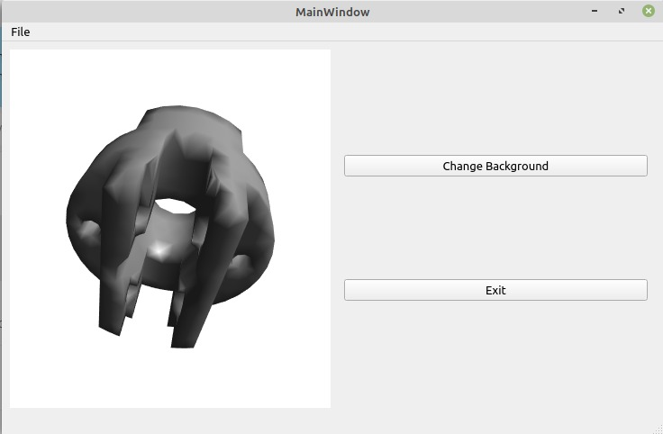
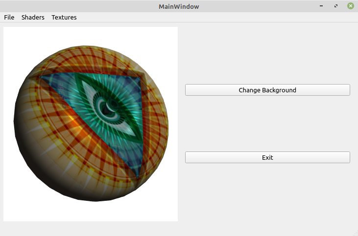
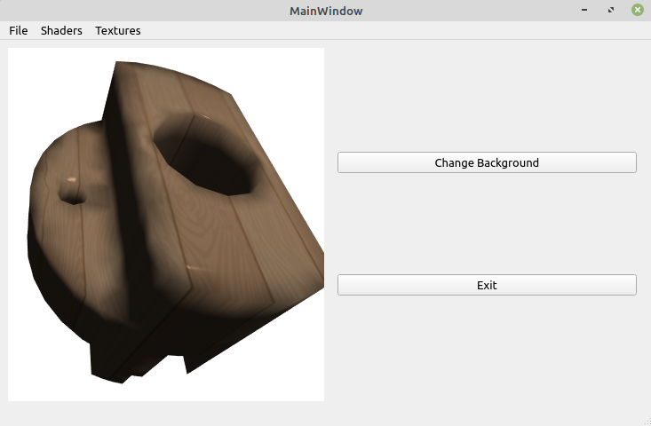
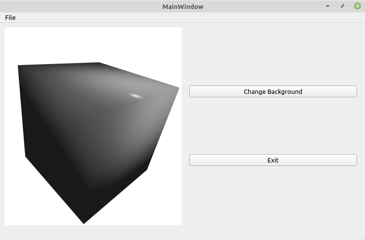
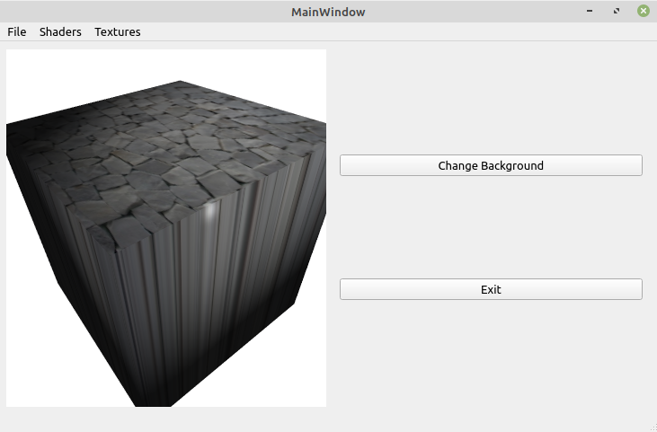
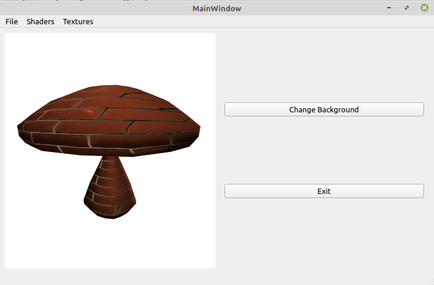

# opengl-3d-visualizer

This project uses Qt and OpenGL to create a program that renders uncolored .off objects with triangular faces and textures.



# How to compile and execute

Softwares used in this project:

- Qt Creator 4.13.3
- Qt 5.15.2
- GCC 5.3.1 20160406 (Red Hat 5.3.1-6) 64 bit
- CMake 3.19.0
- QMake 3.1

## First way:

Just use Qt Creator to open `openglvisualization.pro`

## Second way:

Compiling and running on Linux:
```
qmake openglvisualization.pro
make
./openglvisualization
```

Maybe you can find qmake on Linux through this command `sudo find / -name "qmake" -type f`

In my case, qmake is at `$HOME/Qt/5.15.2/gcc_64/bin/qmake`

You will use the same commands on Windows. To find qmake on Windows, go to your Qt installation folder and run `dir /s qmake.exe` or `dir /s qmake` for CMD or `ls -r qmake` or `ls -r qmake.exe` for PowerShell.

# Implementation

## Class GLWidget

```cpp
class GLWidget : public QGLWidget
{
    /**
     * @brief Tells Meta Object Compiler (MOC) that this class need to be translated
     * to a normal C++ class because it contains signals, slots and other
     * features from Qt framework.
     */
    Q_OBJECT

public:
    /**
     * @brief Initializes GLWidget parent class and internal fields.
     * 
     * @param parent Parent widget.
     */
    explicit GLWidget(QWidget *parent = nullptr);
    /**
     * @brief Destroy the GLWidget object releasing VBOs and shaders.
     */
    virtual ~GLWidget();

protected:
    /**
     * @brief Load and active textures and start main loop using a timer.
     */
    void initializeGL();
    /**
     * @brief Resize projection matrix when widget resizes.
     * 
     * @param width new widget width.
     * @param height new widget height.
     */
    void resizeGL(int width, int height);
    /**
     * @brief Renders the object including light calculations.
     */
    void paintGL();
    /**
     * @brief Track the mouse movements to properly rotate the object when user
     * click and drag.
     */
    void mouseMoveEvent ( QMouseEvent * event );
    /**
     * @brief Track the mouse movements and rotate the object.
     */
    void mousePressEvent ( QMouseEvent * event );
    /**
     * @brief Stop tracking the mouse movements.
     */
    void mouseReleaseEvent ( QMouseEvent * event );
    /**
     * @brief Change zoom rate.
     */
    void wheelEvent ( QWheelEvent * event );
    /**
     * @brief Change shaders and textures.
     * 
     * Press 0 to use Gouraud shading.
     * 
     * Press 1 to use Phong shading.
     * 
     * Press 2 to use Phong shading + texture.
     * 
     * Press 3 to use normal mapping.
     */
    void keyPressEvent ( QKeyEvent * event );

private:
    /**
     * @brief Flag that indicates if the GLWidget background is black or not
     */
    bool bgBlack;
    /**
     * @brief Number of vertices of the .off object
     */
    unsigned int numVertices;
    /**
     * @brief Number of faces of the .off object
     */
    unsigned int numFaces;
    /**
     * @brief Array of the vertices of the .off object
     */
    QVector4D *vertices;
    /**
     * @brief Array of the normals of the vertices relative to their faces.
     */
    QVector3D *normals;
    /**
     * @brief Array of the texture coordinates.
     */
    QVector2D *texCoords;
    /**
     * @brief Array of the tangents between the object and its vertices.
     */
    QVector4D *tangents;
    /**
     * @brief Array of the indices of the vertices of each face.
     */
    unsigned int *indices;

    /**
     * @brief Array of Vertex Buffer Objects (VBOs) for the vertices.
     */
    QGLBuffer * vboVertices ;
    /**
     * @brief Array of Vertex Buffer Objects (VBOs) for the vertices normals.
     */
    QGLBuffer * vboNormals ;

    /**
     * @brief Array of Vertex Buffer Objects (VBOs) for the texture coordinates.
     */
    QGLBuffer * vboTexCoords ;
    /**
     * @brief Array of Vertex Buffer Objects (VBOs) for the vertices tangents.
     */
    QGLBuffer * vboTangents ;
    /**
     * @brief Array of Vertex Buffer Objects (VBOs) for the indices
     * of the vertices of each face.
     */
    QGLBuffer * vboIndices ;

    /**
     * @brief Array of Vertex Shader that will handle vertex lightning and
     * texture calculations.
     */
    QGLShader * vertexShader ;
    /**
     * @brief Array of Fragment Shader that will handle pixels lightning and
     * texture calculations between vertices.
     */
    QGLShader * fragmentShader ;
    /**
     * @brief This program receives the shaders it needs to run in your GPU
     * and run them for each vertex or pixel.
     */
    QGLShaderProgram * shaderProgram ;
    /**
     * @brief Number that will select which shader the user wants to use.
     */
    unsigned int currentShader ;

    /**
     * @brief Store each texture ID returned by glBindTexture.
     */
    int texID [2];

    /**
     * @brief Matrix that represents the Model to World and World to View
     * transformations (translation, rotation and scaling). To transform the
     * object, the shader multiplies each object pixel by this matrix.
     */
    QMatrix4x4 modelViewMatrix ;
    /**
     * @brief Matrix that represents the View to Projection transformation (3D to 2D).
     * To transform the object, the shader multiplies each object pixel by this matrix.
     */
    QMatrix4x4 projectionMatrix ;

    /**
     * @brief Camera object that contains the eye position and the lookAt position.
     * Basically this indicates that your eye is at X and you want to look to Y.
     */
    Camera camera ;
    /**
     * @brief Light object that has the position of the light, the multiplication
     * factor of the ambient, the multiplication factor of diffusion (light strikes
     * and reflects in multiple directions) and the multiplication factor of specular
     * highlight.
     */
    Light light ;
    /**
     * @brief Material object that has the multiplication factor of the ambient, the
     * multiplication factor of diffusion (light strikes and reflects in multiple
     * directions), the multiplication factor of specular highlight and the shininess.
     */
    Material material ;

    /**
     * @brief Class that handles rotation based on mouse movement.
     */
    TrackBall trackBall ;

    /**
     * @brief Zoom percentage
     */
    double zoom;
    /**
     * @brief Would store FPS count. But this is not being used.
     */
    int fpsCounter;

    /**
     * @brief Used to paint the scene forever.
     */
    QTimer timer;

    /**
     * @brief Change current shader.
     * @param shaderIndex
     */
    void useShader(int shaderIndex);
    /**
     * @brief Change current texture.
     * @param textureIndex
     */
    void useTexture(int textureIndex);
    /**
     * @brief Read uncolored .off objects with triangular faces.
     * 
     * @param fileName .off filename.
     */
    void readOFFFile(const QString &fileName);
    /**
     * @brief Calculate the normals for each vertex in its face.
     */
    void genNormals();
    /**
     * @brief Calculate the texture coordinates for each vertex in its face.
     */
    void genTexCoordsCylinder () ;
    /**
     * @brief Calculate the tangents for each vertex in its face.
     */
    void genTangents () ;
    /**
     * @brief Create the Vertex Buffer Objects (VBOs) for each vertex, normal,
     * texture, tangent and index.
     */
    void createVBOs () ;
    /**
     * @brief Destroy the Vertex Buffer Objects (VBOs).
     */
    void destroyVBOs () ;
    /**
     * @brief Create all shaders for vertices and fragments.
     */
    void createShaders () ;
    /**
     * @brief Destroy all shaders.
     */
    void destroyShaders () ;

    QPointF pixelPosToViewPos ( const QPointF &p);

signals:
//    void takeScreenshot();
    void statusBarMessage(QString ns);

public slots:
    void toggleBackgroundColor();
    void showOpenFileDialog();
    void useShader0();
    void useShader1();
    void useShader2();
    void useShader3();
    void useTexture0();
    void useTexture1();
    void useTexture2();
    void useTexture3();
    void useTexture4();
    void animate();
};
```

# Tests and results

https://www.loom.com/share/b7cdca4ae2854b11acb925eec2ceb501

## Apple + Phong + Illuminati Texture Shader



## Socket + Gouraud Shader


## Socket + Phong + Wood Texture Shader



## Cube + Gouraud Shader


## Cube + Phong Shader



## Cube + Phong + Rocks Texture Shader



## Mushroom + Gouraud Shader


## Mushroom + Phong + Bricks Diffuse Texture Shader


